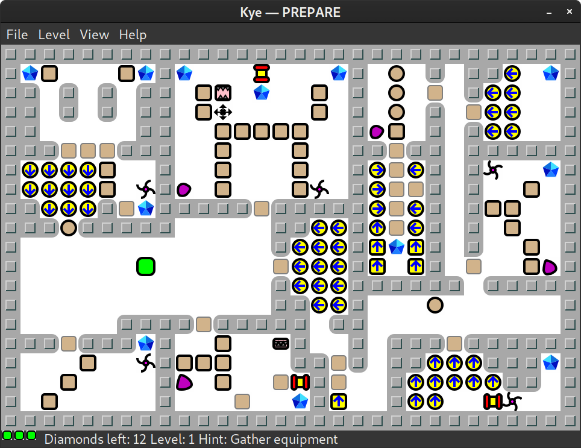

[Colin Phipps]: mailto:cph@moria.org.uk

Kye 1.0
=========

This is a clone of the game Kye for Windows, originally by Colin Garbutt. It is
a puzzle game, which is a little like the old falling-rocks puzzle games, and
perhaps also inspired a little by Sokoban. But Kye has more variety of objects,
and so is capable of posing quite complex puzzles.

This clone is written by [Colin Phipps] in Python and uses Gtk 3. So it will run
on modern Linux systems easily enough, and indeed should work on any system with
working Python and pygobject. It works on Windows as well, for instance.



Linux/Unix Installation
-----------------------

- With Nix (recommended):

  Make sure you have [Nix flakes](https://nixos.wiki/wiki/Flakes) enabled.

  To run the game, simply run:
  ```
  nix run
  ```

- For Debian or Ubuntu:
  `apt-get install python-gtk2 librsvg2-common`

- For FreeBSD:
  `portinstall py24-gtk librsvg2`

To install Kye, run `./setup.py install`; Kye should then be in your path (on
Debian-like system, you may have to install python2.4-dev for this to work).
Or you can just run it from the extracted tarball, with `./Kye`.

Windows Installation
--------------------

This section is untested and likely to be incomplete; please send updates if
you figure out how to make it work.

See http://games.moria.org.uk/kye/download-install#install-win for the latest
Windows install instructions - these are fairly new so the online instructions
may be newer and better. There are quite a few things to install I'm afraid, as
there doesn't seem to be a single installer available that includes the bits
that you need.

- Install Python 3.8, GTK 3, pygobject, and pycairo
- Having run the installers for all of those, you can then download and extract
  Python Kye for Windows (that's what you've done already to be reading this
  file). Extract it to your "My Documents" is fine if you like.
- Run a command prompt, and go to the `kye-1.0` directory that you just
  extracted.
- In the command prompt run

```bat
python Kye.py
```

  And you should see Kye running now.

Playing
-------

I won't bother describing the game in great detail here - learn by playing. You
are "Kye", the green blob. Move by point-and-click, or using the cursor keys -
you can use the numeric keypad too, and you can move diagonally. Holding a key
down causes you to move continuously, after a delay; hold SHIFT down first to
suppress the delay.

You have to collect the diamonds. You have 3 lives (shown in the status bar)
and you lose a life whenever you come into contact with a monster. Blocks with
arrows on are sliders (square) or rockies (round) which (in the direction of
the arrow) move until then run up against an obstacle. The other common objects
are the brown/yellow blocks, which are just inanimate blocks that you can push
around, and the sentries, which are the yellow pointed-square marching things
that can also push stuff around. It's easiest to learn the game by playing some
easier levels - it loads intro.kye by default when it is run, and this gives a
few easy levels to get you into the swing of things.

See <http://games.moria.org.uk/kye/> for more introduction to the game, and in
particular <http://www.youtube.com/watch?v=is-9SjYr_WE> which is a
demonstration video that I have put together which shows the game elements. If
you would like me to put up more explanatory videos, let me know (my email
address is at the end of this readme).

Once you understand the basics, you can go looking for some more challenging
levels to play. There are more levels on my site at
<http://games.moria.org.uk/kye/mylevels> ;
there are many levels available from sites listed in
<http://dmoz.org/Games/Video_Games/Puzzle/Mazes/Shareware/Kye/> ;
and the levels distributed with the original Kye game are available at:
<http://www.classicgaming.com/kye/registration.htm>

You can write your own levels for Kye. Run Kye-edit to use the included level
editor. See http://games.moria.org.uk/kye/pygtk#editing for further
instructions.

To use Kye, you have to have a set of images - one such set is supplied by
default, but others are available. The Linux version includes a set of images
which I have designed, which are done as SVG so they work better at larger
screen sizes; these are included by default in the Linux version. My images are
open-source like Python Kye itself, whereas the original game images are owned
by Colin Garbutt, which is why I don't distribute those as part of this package
- if you prefer to use the original game images, you can download the
alternative `images.tar.gz` from my website, and replace the `images.tar.gz` in
this directory (or, if you have already installed Python Kye, drop them in
either `/usr/local/share/kye/` or `/usr/share/kye`, or just in the directory where
you run Kye). (Note that the Windows version ships with the original game
images by default.)

Copyright & Charityware
-----------------------

This version of Kye is Copyright (C) 2004-2010 [Colin Phipps](mailto:cph@moria.org.uk).
It is made available under the GNU General Public License (see the file [COPYING](./COPYING)
for details). Furthermore, as the game idea comes from the original Kye game,
to maintain the spirit of the original distribution rules, Kye is charityware -
if you enjoy playing Kye, you are encouraged to donate to a children's charity
(Save the Children was the beneficiary of the original Kye, but the NSPCC, or
whatever equivalent charities are available in your own country, will do just
as well).

Authors & Acknowlegements
-------------------------

Python Kye and the supplied levels & graphics are written by [Colin Phipps].
Python Kye is Copyright (c) 2004, 2005, 2006, 2007, 2010 by [Colin Phipps];
it is distributed under the GNU General Public License v2, see COPYING for details.

It is modelled on the original Kye for Windows by Colin Garbutt.

Thanks also to:

<vexorian@gmail.com>
  for useful feedback, and information about the original Kye

[Viktor Kerkez](alef@atomixlinux.org)
  for the basis of the RPM spec file, & I have incorporated some of his patches.
